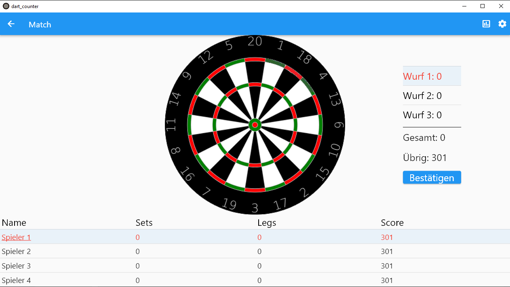

# DartCounter

An application to keep track of a Dart match

It is currently made for Windows-only use, but you can build it for any Platform if you want,
but due to the needed size of the application it will only work good on Desktops.

The app currently supports up to 4 players, and has some statistics that may or may not work.
It is currently available for download under the Releases tab over an msix-installer.